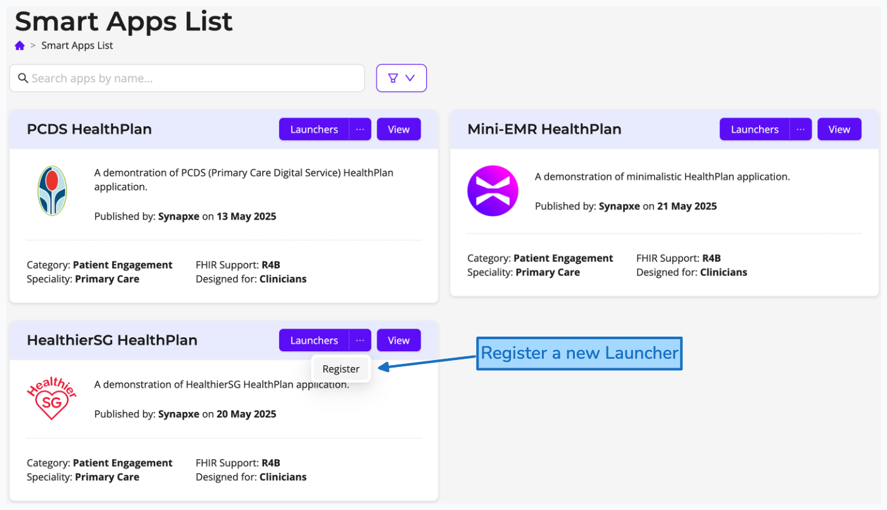
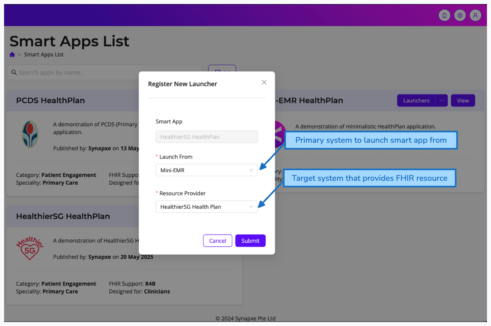

# AWS-HXIS User Apps Platform Sample Vite React App

## About

This sample Vite React app serves as a reference for developers working with the AWS-HXIS User Apps Platform. It provides a structured setup to get started with the platform and connects seamlessly with FHIRNexus APIs for both development and production environments.

### Tech Stack Overview

This sample project utilizes the following technologies:

- **[Vite](https://vitejs.dev/)**: A fast build tool and development server for modern web projects.
- **[React](https://reactjs.org/)**: A JavaScript library for building user interfaces.
- **[TypeScript](https://www.typescriptlang.org/)**: A strongly typed programming language that builds on JavaScript.
- **[Tailwind CSS](https://tailwindcss.com/)**: A utility-first CSS framework for rapid UI development.
- **[React OIDC Context](https://www.npmjs.com/package/react-oidc-context)**: Used for authentication.
- **[FHIRClient](https://github.com/smart-on-fhir/client-js)**: A library for interacting with FHIR APIs.
- **[Zod](https://github.com/colinhacks/zod)**: A TypeScript-first schema declaration and validation library.
- **[Ant Design](https://ant.design/)**: A design system for enterprise-level products.
- **[RTK Query](https://redux-toolkit.js.org/rtk-query/overview)**: A data-fetching and caching library for Redux.

These technologies provide a robust and scalable foundation for developing provider-facing applications on the AWS-HXIS User Apps Platform.

### Who should use this?

If your project meets the following criteria, this template is for you:

- Planning to use APIs provided by HealthX
- Deploymenting on the HealthX User Apps Platform
- (Optional) Launching Smart Apps via HealthX SmartOnFHIR Integration

---

## Table of Contents

1. [Getting Started](#1-getting-started)
2. [Project Setup](#2-project-setup)
3. [Environment Configuration](#3-environment-configuration)
4. [TypeScript Environment Validation](#4-typescript-environment-validation)
5. [Authentication](#5-authentication)
6. [Development](#6-development)
7. [Production](#7-production)
8. [Deployment](#8-deployment)
9. [SmartOnFHIR Integration](#9-smartonfhir-integration)
10. [Additional Notes](#10-additional-notes)
11. [License](#11-license)

---

## 1. Getting Started

### Prerequisites

Ensure you have the following installed:

- [Node.js](https://nodejs.org/) (v18 or later)
- [Git](https://git-scm.com/)

### Installation

1. **Clone the Repository**

```bash
git clone https://github.com/HealthTechSG/HealthX-UserApp-Sample
cd HealthX-UserApp-Sample
```

2. **Install Dependencies**

Navigate into the project directory and install dependencies:

```bash
npm install
```

---

## 2. Project Setup

This project follows a feature-based architecture to promote maintainability and scalability. The codebase is organized into distinct modules, each responsible for specific functionality.

### Project Structure Overview

```
.
├── /docs           # Documentation files for project reference
├── /env            # Environment configuration files
├── /public         # Static files served by the webserver
├── /src            # Application source code
│   ├── /app        # Core app components and providers
│   ├── /assets     # Static assets (images, icons, etc.)
│   ├── /common     # Shared components, hooks, and utilities
│   ├── /configs    # Global configuration files
│   ├── /features   # Feature-based modules
│   ├── /i18n       # Internationalization resources
│   ├── /redux      # Redux state management
│   ├── /services   # API services and data fetching
│   └── /utils      # Utility functions
└── ... (configuration files)
```

To set up your development environment, copy the sample environment files from the `env` folder to create your own local configuration:

```bash
cp env/.env.development.sample env/.env.development.local
# Edit env/.env.development.local with your settings
```

See the [Environment Configuration](#3-environment-configuration) section for details on configuring your environment variables.

---

## 3. Environment Configuration

The project uses consistent environment variables for both development and production to allow seamless transitions between environments. Configuration files are stored in the `env` folder.

### Environment Variables

Below is a sample of the environment configuration (`.env.development.sample` or `.env.production.sample`):

```plaintext
# ==============================================================================
# User App configuration - Variables are retrievable from HXIS User Apps platform
# 1. Visit User Apps platform (https://developer.healthx.sg/userapp)
# 2. Select User App
# 3. View Details
# ==============================================================================
VITE_APP_TITLE='User App (Development)'
VITE_APP_BASE_URL="/apps"
VITE_APP_ID='app-123'
VITE_FHIR_API_BASE_URL='https://api.healthx.sg/fhir/r4b/tenant-123'
VITE_FHIR_API_KEY="api-key-123"

# ==============================================================================
# Authentication configuration - Variables are retrievable from HXIS User Apps platform
# 1. Visit User Apps platform (https://developer.healthx.sg/userapp)
# 2. Select User App
# 3. View Details
# ==============================================================================
VITE_OIDC_AUTHORITY='https://auth.healthx.sg/realms/tenant-123'
VITE_OIDC_CLIENT_ID='client-123'
VITE_OIDC_REDIRECT_URI='http://localhost:3000${VITE_APP_BASE_URL}/${VITE_APP_ID}'

# ==============================================================================
# * This section is only required if you are launching a Smart App
# Smart App Launch configuration - Variables are retrievable from HXIS Smart Apps Gallery
# 1. Visit Smart Apps Gallery (https://smartapps.healthx.sg)
# 2. Select Smart App
# 3. View Launchers
# 4. Select Launcher
# ==============================================================================
VITE_SMART_LAUNCH_TOKEN_URL='https://auth.healthx.sg/launch'
```

### Obtaining Configuration Values

- **User App Configuration**: Values for app title, ID, and API endpoints can be obtained from the [HealthX User Apps Platform](https://developer.healthx.sg/userapp) by selecting your app and viewing its details.

- **Authentication Configuration**: OIDC credentials are also available in the User Apps Platform under your app's details.

- **Smart App Launch Configuration**: If your app integrates with Smart Apps, you can retrieve the required values from the [HealthX Smart Apps Gallery](https://smartapps.healthx.sg).

### Development vs Production

For development, use `.env.development`, which typically points to:

- Local or test instances of your app
- Test APIs and authentication services
- Localhost redirect URIs

For production, use `.env.production`, with:

- Production endpoints and URLs
- Production authentication configuration
- Domain-based redirect URIs

Copy the sample files to create your own environment files (e.g., `.env.development.local` or `.env.production.local`) which will not be tracked by version control.

---

## 4. TypeScript Environment Validation

The `<root>/src/env.config.ts` file is used to validate and type-check environment variables, ensuring correct configuration for the app. This setup uses `@julr/vite-plugin-validate-env` with `zod` schemas for type safety and validation.

```typescript
// file: src/env.config.ts

//* This file is used to define the environment variables that are required for the application to run.
//* You can customize the schema to fit your needs.

import { defineConfig as defineEnvConfig } from '@julr/vite-plugin-validate-env';
import { z } from 'zod';

// =============================================================================
// ! These are the required environment variables for the application to run.
// ! Only edit them if you know what you are doing.
// =============================================================================
const requiredSchema = {
  //* Application ==============================================================
  // VITE_APP_BASE_URL is always "/apps" in production mode, to deploy on User Apps platform
  VITE_APP_BASE_URL: z.preprocess(
    (val) => {
      if (process.env.NODE_ENV === 'production') return '/apps';
      return val;
    },
    z.string().min(1, {
      message: 'Base URL is required, e.g. /apps',
    }),
  ),
  VITE_APP_TITLE: z.string().min(1, {
    message: 'App Title is required, e.g. Mini-EMR',
  }),
  VITE_APP_ID: z.string().min(1, {
    message:
      'App ID (uuid) is required, e.g. g59846c5-fc5e-4f3e-8cb3-6491578195ad',
  }),
  VITE_FHIR_API_BASE_URL: z.string().min(1, {
    message:
      'FHIR API Base URL is required, e.g. https://api.healthx.sg/fhir/r4b/<tenant>',
  }),
  VITE_FHIR_API_KEY: z.string().min(1, {
    message:
      'FHIR API Key is required, e.g. <fhir-api-key>, to access the FHIR API',
  }),

  //* Authentication ===========================================================
  VITE_OIDC_AUTHORITY: z.string().min(1, {
    message:
      'OIDC Authority is required, e.g. https://auth.healthx.sg/realms/<realm>',
  }),
  VITE_OIDC_CLIENT_ID: z.string().min(1, {
    message: 'OIDC Client ID is required, e.g. <client-id>',
  }),
  VITE_OIDC_REDIRECT_URI: z.string().min(1, {
    message:
      'OIDC Redirect URI is required, e.g https://userapps.healthx.sg/apps/<app-id>',
  }),

  //* SmartonFHIR ==============================================================
  VITE_SMART_LAUNCH_TOKEN_URL: z
    .string()
    .url({
      message:
        'Need a valid URL for the Smart Launch Token, e.g. https://auth.healthx.sg/launch',
    })
    .optional(),
  VITE_SMART_APP_BASE_URL: z
    .string()
    .url({
      message:
        'Need a valid URL for the Smart App Base URL, e.g. https://userapps.healthx.sg/apps/<app-id>/launch',
    })
    .optional(),
  VITE_SMART_FHIR_RESOURCE_BASE_URL: z
    .string()
    .url({
      message:
        'Need a valid URL for the Smart FHIR Resource Base URL, e.g. https://api.healthx.sg/fhir/r4b/<tenant>',
    })
    .optional(),
};

// =============================================================================
// * Define the environment variables configuration below
// =============================================================================
export default defineEnvConfig({
  validator: 'zod',
  schema: {
    ...requiredSchema,
    // More environment variables... (add to your use case)
  },
});
```

Refer to the [`zod` documentation](https://github.com/colinhacks/zod) for more complex validation schemas.

---

## 5. Authentication

The User App uses OpenID Connect (OIDC) for authentication, implemented through the `react-oidc-context` library. This approach provides a standardized authentication flow that works with various identity providers compatible with the OIDC protocol.

This project leverages the following packages for authentication:

- **[`react-oidc-context`](https://www.npmjs.com/package/react-oidc-context)**: Provides React context and hooks for OpenID Connect authentication.
- **[`oidc-client-ts`](https://www.npmjs.com/package/oidc-client-ts)**: The underlying OIDC client library that handles the authentication protocol.

### Authentication Configuration

The authentication configuration is set up in the main `App.tsx` file:

```typescript
import { AuthProvider, type AuthProviderProps } from 'react-oidc-context';
import { WebStorageStateStore } from 'oidc-client-ts';

const AuthProviderConfig: AuthProviderProps = {
  // OIDC Configuration
  authority: import.meta.env.VITE_OIDC_AUTHORITY,
  client_id: import.meta.env.VITE_OIDC_CLIENT_ID,
  redirect_uri: import.meta.env.VITE_OIDC_REDIRECT_URI,

  // Uses localStorage for user session
  userStore: new WebStorageStateStore({
    store: window.localStorage,
  }),
};

const App = () => (
  <AuthProvider {...AuthProviderConfig}>
    {/* Rest of the application */}
  </AuthProvider>
);
```

### Using the Authentication Hooks

The `react-oidc-context` library provides hooks to access authentication state and user information throughout your application:

```typescript
import { useAuth } from 'react-oidc-context';

function Profile() {
  const auth = useAuth();

  if (auth.isLoading) {
    return <div>Loading...</div>;
  }

  if (auth.error) {
    return <div>Oops... {auth.error.message}</div>;
  }

  if (auth.isAuthenticated) {
    return (
      <div>
        Hello {auth.user?.profile.given_name}{' '}
        <button onClick={() => auth.signoutRedirect()}>Log out</button>
      </div>
    );
  }

  return <button onClick={() => auth.signinRedirect()}>Log in</button>;
}
```

### Protected Routes

The application uses a `ProtectedRoute` component to restrict access to authenticated users only:

```typescript
// In ProtectedRoute.tsx
import { PropsWithChildren } from 'react';
import { withAuthenticationRequired } from 'react-oidc-context';

const ProtectedRoute = withAuthenticationRequired(
  ({ children }: PropsWithChildren) => children,
  {
    OnRedirecting: () => (
      <div className="flex h-screen items-center justify-center">
        <h1 className="text-2xl font-bold">Redirecting to login...</h1>
      </div>
    ),
  },
);

export default ProtectedRoute;
```

Usage in your routes (as shown in PatientRoutes.tsx):

```typescript
import ProtectedRoute from '@/common/components/ProtectedRoute';
import { BasePageRouteObject } from '@/common/types';
import { RouteMap } from '@/configs';

const { PatientPaths } = RouteMap;

const PatientRoutes: BasePageRouteObject[] = [
  {
    path: PatientPaths.PatientList,
    element: (
      <ProtectedRoute>
        <PatientListPage />
      </ProtectedRoute>
    ),
    handle: {
      pageTitle: 'Patient List',
      breadcrumbs: [{ title: 'Patient List' }],
    },
  },
  // Other routes...
];
```

### Development Considerations

For development purposes, ensure that your OIDC provider is properly configured to allow redirects to your local development URL (typically `http://localhost:5173` if using the default Vite port).

Make sure to set the proper environment variables as specified in the Environment Configuration section:

- `VITE_OIDC_AUTHORITY`: The URL of your OpenID Connect provider
- `VITE_OIDC_CLIENT_ID`: Your application's client ID registered with the OIDC provider
- `VITE_OIDC_REDIRECT_URI`: The URL where users should be redirected after authentication

---

## 6. Development

### Running the Development Server

To start the development server:

```bash
npm run dev
```

This will launch the app in development mode with hot reloading.

---

## 7. Production

### Building for Production

To build the application for production:

```bash
npm run build
```

This will generate an optimized bundle for production.

### Preview the Production Build

```bash
npm run preview
```

---

## 8. Deployment

To deploy to the User Apps Platform:

1. **Build the Application for Production**

```bash
npm run build
```

2. **Prepare for Upload**

Zip the contents of the `dist` folder:

```bash
zip -r dist.zip dist
```

3. **Upload to the User Apps Platform**

Log in to the [User Apps Platform](https://developer.healthx.sg/userapp) and upload the `dist.zip` file.

---

## 9. SmartOnFHIR Integration

This application includes support for launching Smart Apps within your User App via our SmartOnFHIR enablement. This allows you to embed external healthcare applications that can access patient data through a standardized protocol that defined by [HL7 SMART App Launch](https://hl7.org/fhir/smart-app-launch/app-launch.html).

### Prerequisites

Before using the SmartOnFHIR integration, ensure you have:

1. **A Provisioned User App**: This is the primary application from which you'll launch the Smart App.

2. **A Target Resource Endpoint**: This is the FHIR service endpoint the Smart App will access data from. It can be the same user app you're launching from or a different User App.

3. **A Smart App Launcher Configuration**: Created on the Smart App Gallery platform to configure identity federation between your primary and target systems. This configuration establishes trust relationships that enable single sign-on (SSO) capabilities, allowing users to seamlessly launch Smart Apps without re-authentication.

#### Setting Up a Smart App Launcher

1. **Access the Smart App Gallery**: Visit [HealthX Smart Apps Gallery](https://smartapps.healthx.sg)

2. **Select the Smart App you want to integrate with your User App**

3. **Register a new Launcher**:

- Select register via dropdown

- Configure primary and target systems

4. **Obtain Launcher Details**: After configuration, you'll receive:
   - Smart App Base URL
   - Launch Token URL
   - FHIR Resource Base URL

### Environment Configuration

Add the following environment variables to your configuration:

```plaintext
# Smart App Launch configuration
VITE_SMART_LAUNCH_TOKEN_URL='https://auth.healthx.sg/launch'
VITE_SMART_APP_BASE_URL='https://smartapps.healthx.sg/app/example-app'
VITE_SMART_FHIR_RESOURCE_BASE_URL='https://api.healthx.sg/fhir/r4b/tenant-123'
```

### Implementing Smart App Launch

The application provides components to easily embed Smart Apps in your User App:

#### Using the SmartApp Component

```typescript
import SmartApp from '@/features/Patient/components/PatientSmartApp/SmartApp';
import { useAuth } from 'react-oidc-context';
import { fetchLaunchToken } from 'smartonfhir-launcher-react';

const YourComponent = () => {
  const { user } = useAuth();

  // Callback to resolve the launch token
  const launchToken = useCallback(
    (context) =>
      fetchLaunchToken(import.meta.env.VITE_SMART_LAUNCH_TOKEN_URL!, context, {
        Authorization: `Bearer ${user?.access_token}`,
      }),
    [user?.access_token],
  );

  return (
    <div className="h-[70vh] w-full">
      <SmartApp
        baseUrl={import.meta.env.VITE_SMART_APP_BASE_URL!}
        iss={import.meta.env.VITE_SMART_FHIR_RESOURCE_BASE_URL!}
        launchContext={{
          patientPrn: "patient-identifier", // Patient identifier
          need_patient_banner: true,
          sso_token: user?.access_token,
        }}
        launchToken={launchToken}
      />
    </div>
  );
};
```

### Launch Flow Explanation

The SmartOnFHIR launch process works as follows:

1. **Initialize Launch**: When a user accesses a page with an embedded Smart App, the `SmartApp` component begins the launch process.

2. **Context Preparation**: The component prepares a launch context containing:

   - Patient identifier (if applicable)
   - User's authentication token
   - Other required context parameters

3. **Token Acquisition**: The component calls the launch token endpoint with the prepared context to get a one-time use launch token.

4. **App Launch**: The Smart App is loaded in an iframe with the launch token, enabling it to access the FHIR resources it needs without requiring the user to authenticate again.

5. **Data Access**: The Smart App uses the launch token to obtain an access token to the FHIR API and then retrieves the necessary patient data.

This flow enables a seamless user experience where a patient's data can be accessed by specialized applications without disrupting the user's workflow or requiring multiple sign-in steps.

---

## 10. Additional Notes

- **FHIR Integration**: This sample app accesses FHIRNexus APIs through the `fhirclient` library. Ensure environment variables for API endpoints and authentication are correctly configured.

- **Development Tools**:

  - `eslint` and `prettier` are configured for code quality and formatting
  - `husky` and `lint-staged` are set up to ensure code quality on commit
  - `source-map-explorer` helps analyze bundle size with `npm run analyze`

- **Documentation**: Additional developer documentation is available in the `/docs` directory, including guides on project structure and template features.

- **For issues or contributions**: Please open an issue or pull request on the project repository.
